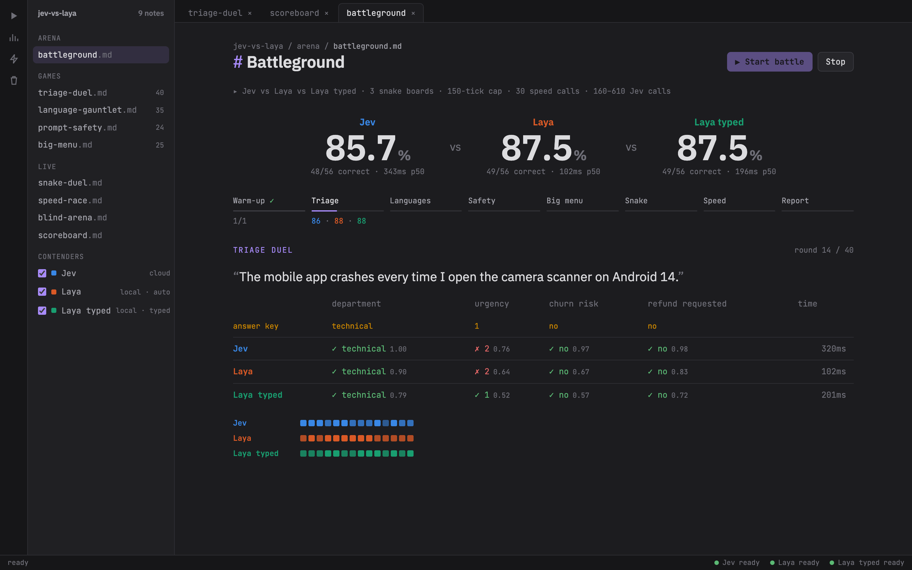
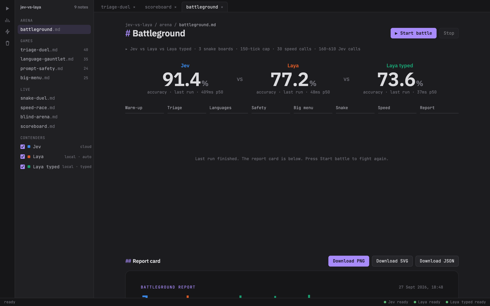
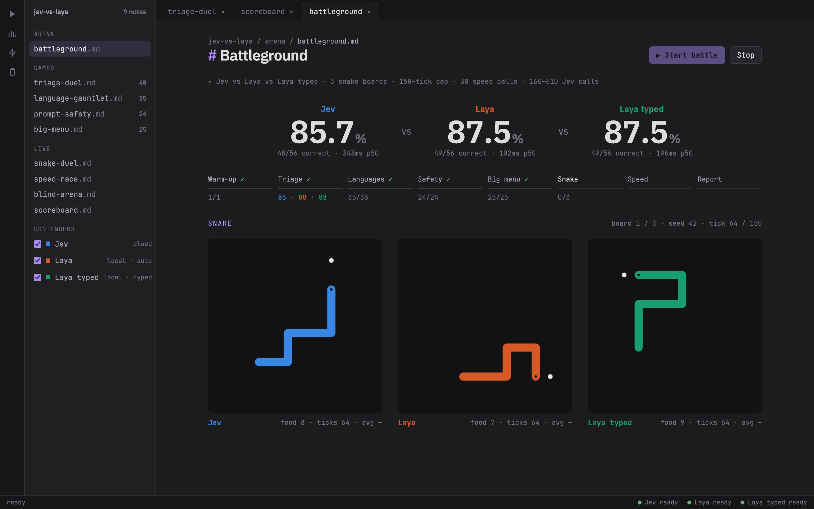
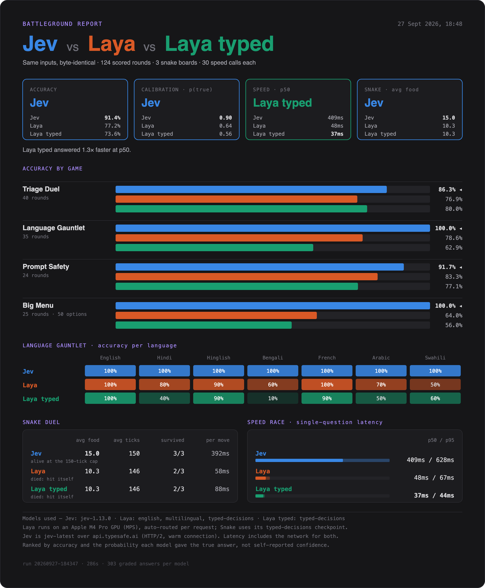
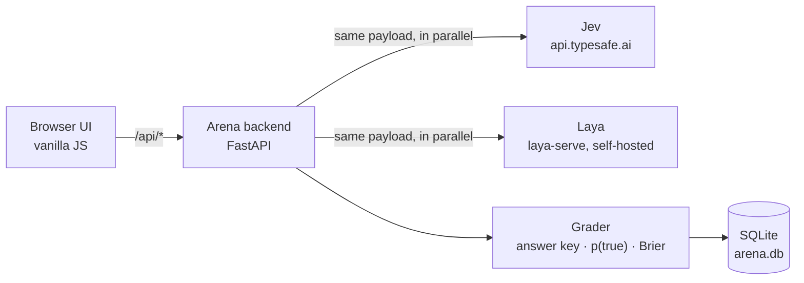

<div align="center">

# ⚔️ Jev vs Laya · Battleground

**Two AI classifiers. Byte-identical inputs. One answer key. Watch them fight live.**

An open-source arena that pits [TypeSafe **Jev**](https://docs.typesafe.ai/introduction) (hosted System One model)
against [**Laya**](https://github.com/NandhaKishorM/laya) (open source, Apache 2.0, self-hosted)
across ticket triage, 7 languages, prompt-injection attacks, a 50-way intent menu, a live Snake duel and a speed race,
then prints a report card.

[](LICENSE)
[](https://github.com/soummyaanon/jev-vs-laya/actions/workflows/ci.yml)


[](CONTRIBUTING.md)
[](https://github.com/soummyaanon/jev-vs-laya/stargazers)



</div>

---

## Why this exists

Leaderboards tell you a model's average. They don't show you **how** it fails on *your* kind of input.
This arena puts two classifiers side by side on the exact same payloads and lets you watch every round:
which option each model picked, how much probability it put on the right answer, and how long it took.

- 🎯 **Fair by construction.** Same state, same wording, same option order, sent to both models in parallel.
- 📐 **Scored on probability, not vibes.** Accuracy, probability on the true answer (p(true)) and Brier score.
  Self-reported confidence is never compared, because each model computes it differently.
- ⚡ **Live.** One click runs every game on a single stage, round by round, then builds a downloadable report card.
- 🧩 **Hackable.** ~1 Python file for the backend, plain JS for the UI, datasets are Python lists. Add a game in minutes.

## Screenshots

| Battleground overview | Snake duel |
|---|---|
|  |  |

<sub>The Snake screenshot shows an illustrative mid-game board.</sub>

<details>
<summary><b>Report card</b> (exported as PNG / SVG / JSON after every battle)</summary>
<br>

</details>

## How it works

Both models speak the same wire protocol, `POST /v1/systemone`: send a **state** plus typed **questions**,
get back structured answers with a probability for every option. One client talks to both.



| Question type | Returns | Example |
|---|---|---|
| `choice` | one option + a probability per option | Which team should handle this ticket? |
| `score` | a value on an ordinal rubric + probabilities | How urgent is this, 0 to 2? |
| `noul` | probability that a yes/no statement is true | Is the customer threatening to cancel? |

API keys stay on the backend. The browser never talks to a model directly.

## Games

| Game | Rounds | What it tests |
|---|---|---|
| **Triage Duel** | 40 | Support tickets: department, urgency, churn risk, refund request |
| **Language Gauntlet** | 35 | Same tickets in English, Hindi, Hinglish, Bengali, French, Arabic, Swahili |
| **Prompt Safety** | 24 | Benign prompts mixed with injection, persona and data-exfiltration attempts |
| **Big Menu** | 25 | One `choice` over 50 banking intents: a stress test for large label spaces |
| **Snake Duel** | live | Every tick is a typed choice over four moves; a flood fill flags dead ends |
| **Speed Race** | live | The same single-question call, repeated: p50 / p95 latency |
| **Blind Arena** | live | Names hidden, order shuffled, you vote, Elo ratings update |

## Quickstart

**Requirements:** Python 3.10+, a [TypeSafe API key](https://console.typesafe.ai/keys), ~3 GB of disk for Laya's checkpoints.

```bash
git clone https://github.com/soummyaanon/jev-vs-laya.git
cd jev-vs-laya

python3 -m venv .venv-laya && source .venv-laya/bin/activate
pip install -r requirements.txt

cp .env.example .env          # put your TYPESAFE_API_KEY in it
./start.sh                    # Laya on :8000, arena on :9000
```

Open **http://localhost:9000/#battleground** and press **▶ Start battle**.

`start.sh` defaults to `LAYA_DEVICE=mps` (Apple GPU). Use `LAYA_DEVICE=cuda` on NVIDIA or `LAYA_DEVICE=cpu` anywhere:

```bash
LAYA_DEVICE=cuda ./start.sh
```

The first run downloads Laya's three checkpoints (english, multilingual, typed-decisions) from Hugging Face.

<details>
<summary><b>Configuration</b></summary>

| Variable | Purpose | Default |
|---|---|---|
| `TYPESAFE_API_KEY` | Jev API key (required for the Jev contender) | none |
| `LAYA_URL` | Laya endpoint | `http://localhost:8000/v1/systemone` |
| `LAYA_API_KEY` | Bearer token, if your Laya server requires one | none |
| `LAYA_DEVICE` | `mps`, `cuda`, `cpu` or `xpu` | `mps` in `start.sh` |

</details>

## Contenders

| Contender | What it is |
|---|---|
| **Jev** | `jev-latest` on TypeSafe's API |
| **Laya** | Laya's router: auto-picks a checkpoint per request by script and language; Snake uses `typed-decisions` |
| **Laya typed** | Laya pinned to the `typed-decisions` checkpoint |

Toggle any two or all three in the sidebar.

## Fairness rules

1. Byte-identical payloads: same state, wording, option order.
2. Rank by p(true) and Brier, never by self-reported confidence.
3. `noul` questions use neutral A/B labels (avoids label bias on Laya's English checkpoint).
4. Every `score` level has a description; `choice` keys are semantic, never `yes`/`no`.
5. Warm-up calls before timing; the Jev client keeps a warm HTTP/2 connection.

## Honest caveats

- The datasets are **small and hand-labelled** (25–160 graded answers per game). Treat results as a
  battleground, not a benchmark. Public datasets are on the roadmap.
- **Latency depends on where each model runs** (cloud API vs your own hardware).
- **Snake measures option-following**, and it is sensitive to option wording. It's the fun round, not the verdict.

## Project layout

```
arena.py        FastAPI backend: model clients, grading, snake, speed, Elo, reports
games.py        Datasets: every round is {state, questions, gold}
web/            UI: index.html, app.js (notes, games), sim.js (battleground + report card), style.css
start.sh        Starts Laya and the arena together
arena.db        Local results (SQLite, git-ignored)
```

## Add your own game

A game is just a list of rounds. Add one to `games.py`:

```python
MY_Q = {"sentiment": {"type": "choice", "instructions": "What is the tone of this review?",
                      "criteria": {"positive": "happy, satisfied", "negative": "angry, disappointed"}}}

def my_rounds():
    return [{"state": "Arrived broken, never again.", "questions": MY_Q, "gold": {"sentiment": "negative"}}]

GAMES["mygame"] = {"title": "My Game", "rounds": my_rounds}
```

It shows up in the API right away. See [CONTRIBUTING.md](CONTRIBUTING.md) for wiring it into the UI and the battleground.

## Roadmap

- [ ] Public datasets: [Banking77](https://huggingface.co/datasets/PolyAI/banking77), [MASSIVE](https://huggingface.co/datasets/AmazonScience/massive), [deepset/prompt-injections](https://huggingface.co/datasets/deepset/prompt-injections)
- [ ] 95% confidence intervals on the report card; only call a winner when intervals don't overlap
- [ ] Pluggable contenders: any `/v1/systemone`-compatible endpoint from config
- [ ] Laya fine-tuned contender
- [ ] Cost per 1k rounds on the report card
- [ ] Docker Compose for one-command setup

Want one of these? Grab it. Issues labelled `good first issue` are a great start.

## Contributing

PRs, new games and bug reports are all welcome. Start with [CONTRIBUTING.md](CONTRIBUTING.md).
Please follow the [Code of Conduct](CODE_OF_CONDUCT.md). Found a security issue? See [SECURITY.md](SECURITY.md).

If this was useful, **a ⭐ helps other people find it.**

## Acknowledgements

- [TypeSafe](https://docs.typesafe.ai/introduction) for Jev and the System One protocol
- [Laya](https://github.com/NandhaKishorM/laya) by NandhaKishorM, open source under Apache 2.0

This project is independent and not affiliated with or endorsed by TypeSafe or the Laya authors.
"Jev", "TypeSafe" and "Laya" are the names of their respective owners' projects.

## License

[MIT](LICENSE)
